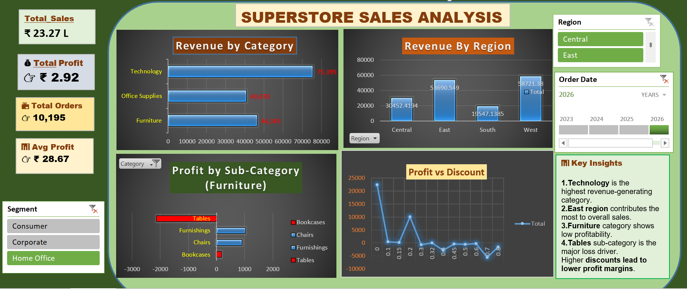

# 📊 E-commerce Sales & Profit Analysis Dashboard

## 🚀 Project Overview

This project focuses on analyzing an e-commerce dataset to uncover key business insights related to sales performance, profitability, and customer segments. The analysis is performed using Microsoft Excel, followed by the development of an interactive dashboard.

---

## 🎯 Objectives

* Analyze sales and profit trends across categories and regions
* Identify loss-making areas and key revenue drivers
* Understand the impact of discounts on profitability
* Build an interactive dashboard for business decision-making

---

## 🛠️ Tools & Techniques

* Microsoft Excel
* Data Cleaning & Preprocessing
* Pivot Tables & Pivot Charts
* KPI Metrics
* Slicers & Timeline Filters
* Dashboard Design

---

## 📊 Dashboard Features

* KPI Cards: Total Sales, Total Profit, Total Orders, Avg Profit
* Revenue Analysis by Category and Region
* Segment-wise Sales Distribution
* Profit Analysis by Sub-Category
* Discount vs Profit Trend Analysis
* Monthly Sales Trend (Time Analysis)
* Interactive Filters (Region Slicer & Timeline)

---

## 📈 Key Insights

* Technology category is the top revenue contributor
* East region generates the highest sales
* Furniture category shows low profitability
* Tables sub-category is the major source of losses
* Higher discounts negatively impact profit margins
* Sales exhibit seasonal trends across months

---

## 💡 Business Recommendations

* Optimize discount strategies to prevent profit loss
* Focus on high-performing categories like Technology
* Re-evaluate pricing for loss-making products (e.g., Tables)
* Leverage seasonal trends for better inventory planning

---

## 🖼️ Dashboard Preview

---

## 📂 Project Structure

* `Ecommerce_Sales_Dashboard.xlsx` → Excel dashboard file
* `dashboard.png` → Dashboard screenshot

---

## 🧠 Skills Demonstrated

* Data Analysis
* Business Insight Generation
* Data Visualization
* Dashboard Development
* Analytical Thinking

---

## 🔮 Future Enhancements

* Build a Power BI version for advanced visualization
* Perform SQL-based analysis for deeper insights
* Add predictive analysis for sales forecasting

---

## 📌 Conclusion

This project demonstrates how structured data analysis and visualization can help identify business opportunities, optimize strategies, and improve overall profitability.

---
